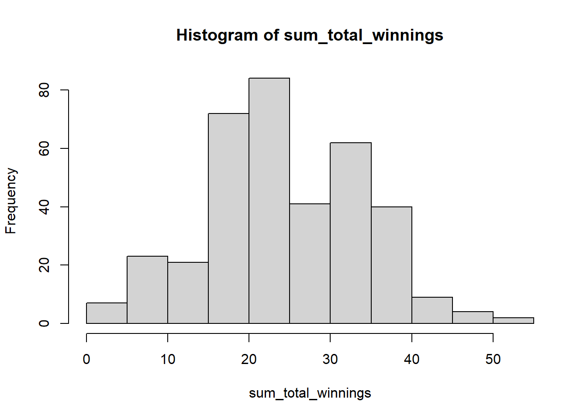

# If else and probability

## If else control flow statement
The if else statement is a control flow statement in R that allows you to execute different code blocks depending on whether a certain condition is true or false. The if else statement has two components: the if clause, which specifies the condition to be evaluated, and the else clause, which specifies the code to be executed if the condition is false.

Here is an example of how to use an if else statement in R:


```r
# define a numeric variable x
x <- 10

# use an if else statement to evaluate the value of x
if (x > 5) {
  print("x is greater than 5")
} else {
  print("x is not greater than 5")
}
#> [1] "x is greater than 5"
```

In this code, we define a numeric variable x with the value 10. We then use an if else statement to evaluate the value of x, and to print a different message depending on whether x is greater than 5 or not.

In this example, we use an if else statement to evaluate the value of the variable x, and to print a message depending on whether x is greater than 5 or not. The if clause of the if else statement contains the condition x > 5, which evaluates to true if the value of x is greater than 5, and to false otherwise. The else clause of the if else statement contains the code print("x is not greater than 5"), which is executed if the condition in the if clause is false.

Here is another example. This code uses an if statement and a for loop to evaluate the elements of the x vector and determine whether each element is greater than 5.

The for loop is used to iterate over the elements of the x vector. For each iteration of the loop, the code checks whether the current element of the x vector is greater than 5. If the element is greater than 5, the code prints a message to the console indicating that the element is greater than 5. If the element is not greater than 5, the code prints a message to the console indicating that the element is not greater than 5.


```r
x <- c(1, 2, 4, -8, 6, 10)

# use an if else statement to evaluate the value of x
for(i in 1:length(x))
if (x[i] > 5) {
  print(paste0(x[i], " is greater than 5"))
} else {
  print(paste0(x[i], " is not greater than 5"))
}
#> [1] "1 is not greater than 5"
#> [1] "2 is not greater than 5"
#> [1] "4 is not greater than 5"
#> [1] "-8 is not greater than 5"
#> [1] "6 is greater than 5"
#> [1] "10 is greater than 5"
```


## If head you get 2 dollars else you loose 1 dollar.
In this game, a player flips a coin and bets on whether it will land on heads or tails. Suppose the coin lands on heads; the player wins 2 dollars. If the coin lands on tails, the player loses 1 dollar. This straightforward game is often used to illustrate probability and statistics concepts. It is not a real game you would typically find in a casino or other gambling establishment, but it can be a fun way to learn about probability and statistics. Let's code this game in R.


```r
# Define the possible outcomes of the coin: head and tail
coin <- c("head", "tail")

# Define the rewards for each coin flip: head wins 2 dollars, tail loses 1 dollar
rewards <- c(2, -1)

# Simulate the coin flip from the possible outcomes
coin_flip <- sample(x = coin, size = 1, replace = T)

# Calculate the win based on the outcome of the coin flip using an if...else statement
if(coin_flip == "head"){
  win <- rewards[1]
} else {
  win <- rewards[2]
}

# Print the outcome and winnings
print(paste("Your coin flipped as", coin_flip, "hence your reward is ", win, "dollars."))
#> [1] "Your coin flipped as head hence your reward is  2 dollars."
```

## For loop and if else together
What would happen if the players played this game? Will you win more than you would lose? To simulate these scenarios, we will use the above example of an if-else conditional statement with for loop. Let's assume you can only play 50 times in one day.


```r
# Define the possible outcomes of the coin: head and tail
coin <- c("head", "tail")

# Define the rewards for each coin flip: head wins 2 dollars, tail loses 1 dollar
rewards <- c(2, -1)

# Initialize the total winnings vector
total_winnings <- c()

# Simulate playing the game 50 times
for (i in 1:50) {
  # Simulate the coin flip from the possible outcomes
  coin_flip <- sample(x = coin, size = 1, replace = T)
  
  # Calculate the win based on the outcome of the coin flip using an if...else statement
  if(coin_flip == "head"){
    win <- rewards[1]
  } else {
    win <- rewards[2]
  }
  
  # store the value of win in total_winnings vector
  total_winnings[i] <- win
  
}

# Sum the total winnings to find your balances
sum(total_winnings)
#> [1] 25
```


## Multiple for loop with one if else together

Let's imagine you play this game for three years until the casino discovers you, and you are banned. What would be your distribution of total_winnings?


```r
# Define the possible outcomes of the coin: head and tail
coin <- c("head", "tail")

# Define the rewards for each coin flip: head wins 2 dollars, tail loses 1 dollar
rewards <- c(2, -1)

# Initialize the sum of total winnings vector
sum_total_winnings <- c()

for(j in 1:365*3){
  # Initialize the total winnings vector
  total_winnings <- c()
  
  # Simulate playing the game 50 times
  for (i in 1:50) {
    # Simulate the coin flip from the possible outcomes
    coin_flip <- sample(x = coin, size = 1, replace = T)
    
    # Calculate the win based on the outcome of the coin flip using an if...else statement
    if(coin_flip == "head"){
      win <- rewards[1]
    } else {
      win <- rewards[2]
    }
    
    # store the value of win in total_winnings vector
    total_winnings[i] <- win
    
  }
  # store the value of sum of total winnings of the day.
  sum_total_winnings[j] <- sum(total_winnings)
}

# To plot the distribution you can use the hist()
hist(sum_total_winnings)
```



We will use this example to understand some basic statistics in the upcoming lecture.

## Exercise
> E1. Suppose you are on a game show and are presented with three closed doors. Behind one of the doors is a prize, while behind the other, two doors are empty. You are asked to choose one of the doors, and then the host of the game show, who knows what is behind each door, opens one of the other two doors to reveal that it is empty. You are then given the option to switch to the other remaining closed door or keep the one you originally chose. What is the probability of winning the prize if you switch doors, and what is the probability of winning if you keep the original door? Which is the best strategy to win the game?
  
Hint: To answer this question, you should first recognize that there are 3 possible doors to choose from and that only 1 of them has the prize behind it. They should then calculate the probability of winning the prize if you switch doors, by using the formula for the probability of an event occurring: probability = number of ways the event can happen / total number of possible outcomes.

For example, the probability of winning the prize if you switch doors is 2/3, because there are 2 possible ways to win the prize (by choosing either of the two doors that do not have the prize behind them) and 3 possible outcomes in total (choosing any of the 3 doors). Similarly, the probability of winning the prize if you keep the original door is 1/3, because there is only 1 way to win the prize (by choosing the door with the prize behind it) and 3 possible outcomes in total. Here is the solution (https://www.youtube.com/watch?v=cXqDIFUB7YU).

