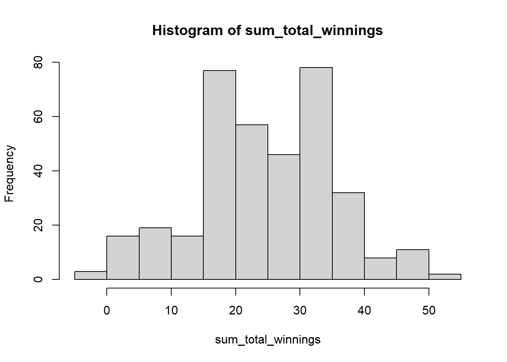

# Basic statistics

## Previous example
We will try to understand basic statistics using the previous example game. 

We will use the previous example game of "if head you get 2 dollars else you loose 1 dollar". If somebody played this game 50 times a day for three years, what would be the potential value of their portfolio? 


```r
# Multiple for loop with one if else together
# Define the possible outcomes of the coin: head and tail
coin <- c("head", "tail")

# Define the rewards for each coin flip: head wins 2 dollars, tail loses 1 dollar
rewards <- c(2, -1)

# Initialize the sum of total winnings vector
sum_total_winnings <- c()

for(j in 1:365*3){
  # Initialize the total winnings vector
  total_winnings <- c()
  
  # Simulate playing the game 50 times
  for (i in 1:50) {
    # Simulate the coin flip from the possible outcomes
    coin_flip <- sample(x = coin, size = 1, replace = T)
    
    # Calculate the win based on the outcome of the coin flip using an if...else statement
    if(coin_flip == "head"){
      win <- rewards[1]
    } else {
      win <- rewards[2]
    }
    
    # store the value of win in total_winnings vector
    total_winnings[i] <- win
    
  }
  # store the value of sum of total winnings of the day.
  sum_total_winnings[j] <- sum(total_winnings)
}

# To plot the distribution you can use the hist()
hist(sum_total_winnings)
```



## Basic statistics
Basic statistics are measures that are used to describe and summarize datasets. Some common basic statistics include the following:

* Mean: The average, or arithmetic mean, is a measure of the central tendency of a dataset. It is calculated by adding all the values in the dataset and dividing by the total number of values. The average is a useful measure because it provides an overall summary of the dataset and can be used to compare different datasets. Lets find the average of `sum_total_winnings` from our previous lecture.


```r
# We can use na.rm to remove NA and NaN values.
# NA and NaN values are not allowed in numeric vectors
# unless na.rm is TRUE.
mean_win <- mean(sum_total_winnings, na.rm = TRUE)
mean_win
#> [1] 24.87671
```

If the mean of your wining are positive then it mean you are expected to make some positive gains.

* Median: The median is the middle value in a dataset when the values are sorted in ascending or descending order. It is a measure of the central tendency of the dataset that is not affected by extreme values. 


```r
median_win <- median(sum_total_winnings, na.rm = TRUE)
median_win
#> [1] 25
```

So, it appears more than half of the time, your wins were 25 or better. Note that we first need to sort the values in ascending or descending order to calculate the median.

* Min and Max: The minimum of a dataset is the smallest value in the dataset. The maximum of a dataset is the largest value in the dataset. These values are commonly referred to as the min and max of the dataset.


```r
min(sum_total_winnings, na.rm = TRUE)
#> [1] -2
max(sum_total_winnings, na.rm = TRUE)
#> [1] 52
```

Min examines your maximum downside. Your maximum downside is -2 dollars. Wow! you upside looks really bright at 52 dollars.

* Range: The range is the difference between the largest and smallest values in a dataset. It is a measure of the dispersion of the dataset.


```r
# Calculate the range
winning_range <- range(sum_total_winnings, na.rm = TRUE)

# Print the range of the dataset
print(winning_range)
#> [1] -2 52

# Min
winning_range[1]
#> [1] -2

# Max
winning_range[2]
#> [1] 52

# Range
winning_range[2] - winning_range[1]
#> [1] 54
```

Here the minimum value is -2 and the maximum value is 52. Thus range is maximum minus minimum which is 54.

The range is one of the measures of dispersion. Measures of dispersion indicate how spread out the values in a dataset is. In fact, there are several measures of dispersion. Let's examine variance and standard deviation.

* Variance: The variance is a measure of how much the values in a dataset differ from the mean. It is a measure of the dispersion of the dataset.


```r
# variance
var(sum_total_winnings, na.rm = TRUE)
#> [1] 117.0589

# sd
sd(sum_total_winnings, na.rm = TRUE)
#> [1] 10.81938
```

* Standard deviation: The standard deviation is the square root of the variance. It is a measure of the dispersion of the dataset that is expressed in the same units as the original data.

## Quantiles to answer probability

If you recall, we have previously defined median as following.


```r
median_win <- median(sum_total_winnings)

median_win
#> [1] NA
```

We interpret the median value of NA as you are 50 percent likely to make NA or less. Thus in a way median captures the probability.

Let's define quantiles and percentiles. Quantiles are values that divide a dataset into equal parts. For example, the median is the value that divides a dataset into two equal parts, and the lower and upper quartiles are the values that divide a dataset into four equal parts.

Quantiles are useful for identifying the values at specific positions in a dataset. For example, the median is used to identify the middle value in a dataset, and the quartiles are used to identify the values at the 25th, 50th, and 75th percentiles.

In general, quantiles are calculated by sorting the values in a dataset in ascending or descending order and then taking the value at a specific position. For example, the median is the middle value in a dataset with an odd number of values or the average of the two middle values in a dataset with an even number of values. The quartiles are the 25th, 50th, and 75th percentile values.

Quantiles are commonly used in statistics to describe a dataset's distribution and identify specific values in the dataset. They are also useful for comparing datasets with different numbers of values. For example, you can compare the median of two datasets to see which has a higher or lower central tendency.

To calculate the quantiles of this dataset in R, we can use the quantile() function. Here's an example:


```r
# Calculate the quantiles of the dataset, we can use na.rm to remove NA and NaN values. NA and NaN values are not allowed in numeric vectors unless na.rm is TRUE.
win_quantiles <- quantile(sum_total_winnings, na.rm = TRUE)

# Print the quantiles of the dataset
print(win_quantiles)
#>   0%  25%  50%  75% 100% 
#>   -2   16   25   31   52
```

Note that `win_quantiles` comprises of 5 different values. We can define those values as following.


```r
# minimum value of dataset
win_quantiles[1]
#> 0% 
#> -2

# 25 percentile of dataset
win_quantiles[2]
#> 25% 
#>  16

# 50 percentile or median of dataset
win_quantiles[3]
#> 50% 
#>  25

# 75 percentile or median of dataset
win_quantiles[4]
#> 75% 
#>  31

# 50 percentile or median of dataset
win_quantiles[5]
#> 100% 
#>   52
```

It seems like you are 25 percent likely to make 16 or less, 50 percent likely to make 16 or less, and 75 percentage likely to make 25 or less.

## Quantiles to generate confidence intervals

In the context of quantiles, the probs argument specifies the probabilities of the quantiles that you want to calculate. For example, if you set probs = c(0.5), the quantile() function will calculate the median of the dataset. If you set probs = c(0.25, 0.75), the quantile() function will calculate the lower and upper quartiles of the dataset.

If you set probs = c(0.025, 0.05, 0.95, 0.975), the quantile() function will calculate the quantiles at the 2.5th, 5th, 95th, and 97.5th percentiles of the dataset. These quantiles are commonly used in statistics to identify extreme values in a dataset. For example, the 2.5th and 97.5th percentiles are used to identify the lower and upper bounds of a 95% confidence interval.

Here's an example of how you could use the probs argument to calculate these quantiles:


```r
# Calculate the 2.5th, 5th, 95th, and 97.5th percentiles of the dataset
dataset_quantiles <- quantile(sum_total_winnings, probs = c(0.025, 0.05, 0.95, 0.975), na.rm = T)

print(dataset_quantiles)
#>  2.5%    5%   95% 97.5% 
#>   1.0   4.6  43.0  46.0
```

Running this code will print the quantiles at the 2.5th, 5th, 95th, and 97.5th percentiles of the dataset in the format "0% 2.5% 5% 95% 97.5% 100%"


```r
dataset_quantiles[1]
#> 2.5% 
#>    1

dataset_quantiles[4]
#> 97.5% 
#>    46
```

It appears that there is a 2.5% likely or probable that your winnings can be 1 or less and 97.5% likely that your winnings can be 46 Alternatively, we can be confident that your winning is 97.5%-2.5%=95% likely to range in between lower bound of 1 and upper bound of 46.

A confidence interval is a range of values used to estimate a population parameter. It is calculated by taking a sample from the population and using statistics such as the mean or median to estimate the population parameter. The confidence interval is then calculated by adding and subtracting a margin of error from the estimate. To calculate the margin of error, you would multiply the standard deviation of the sample by the critical value. However, to understand the critical values, we have to understand the z-statistics. For now, we will skip this.

## Exercise
A stop loss is an order to sell a security when it reaches a certain price. It is used to limit the loss on a trade. For example, if you buy a stock at $100$ and set a stop loss at $95$, the stop loss order will be triggered if the stock price falls to $95$ or lower. This will sell the stock and limit your loss to $5$ per share.

A take profit is the opposite of a stop loss. It is an order to sell a security when it reaches a certain price. It is used to lock in a profit on a trade. For example, if you buy a stock at $100$ and set a take profit at $110$, the take profit order will be triggered if the stock price rises to $110$ or higher. This will sell the stock and lock in a profit of $10$ per share.

Stop losses and take profits are commonly used by traders to manage their trades and limit their risk. They are often used in conjunction with each other to create a trade management strategy. For example, a trader might buy a stock and set a stop loss at the entry price to protect against a sudden drop in the stock price. They might also set a take profit at a higher price to lock in a profit if the stock price rises.

Overall, stopping losses and taking profits are helpful tools for managing risk and protecting against potential losses in a trade. They can help traders to be more disciplined and consistent in their trading and to manage their trades more effectively.

> Let's imagine I decided to day trade (hashtag not financial advice). My trading philosophy is straightforward. I put stop loss at 100 dollars and took profit at 125 dollars. Or if my stock goes down, I limit the loss to 100 dollars, and if my stock goes up, I limit the win to 125. However, call it your skill or the way Mr. Market works. I am no better than a coin flip, so it's 50% likely that I make or lose. I can trigger trade about 99 times a day, and the trading software limits me. However, I can come back tomorrow and trade again. We have 200 trading days in a year, and I have been doing this for the past 5 years. What are my cumulative portfolio values at 90%, 95%, and 99% confidence intervals? What is the probability that I will suffer loss? For the sake of simplicity, there are no fees or commissions.

The above example is not to promote day trade. The economics of the efficient market hypothesis states that no one can consistently beat the Market. See the Marginal Revolution University's Macroeconomics course's Personal Finance section (https://mru.org/courses/principles-economics-macroeconomics/expert-stock-picks). 

The best way of generating wealth is to invest recursively in low-cost index funds, if possible, within tax advantage accounts. See Bogleheads® investment philosophy (https://www.bogleheads.org/wiki/Bogleheads%C2%AE_investment_philosophy).
