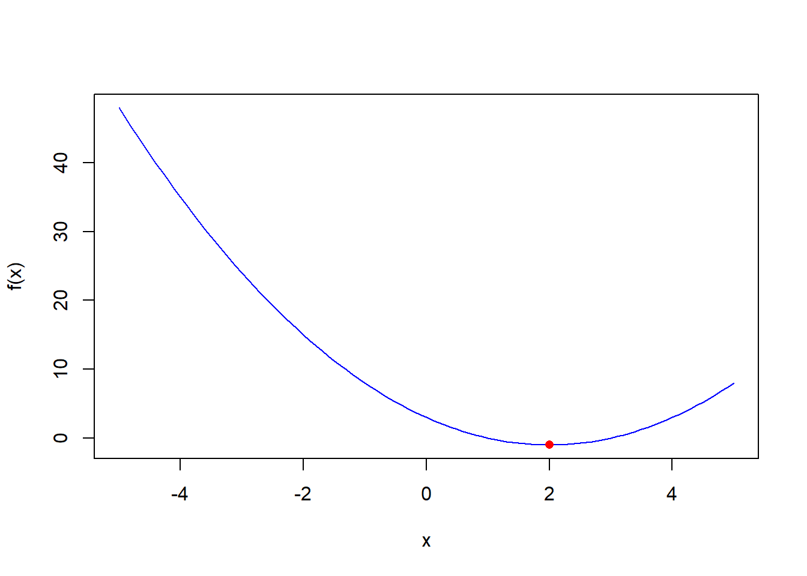
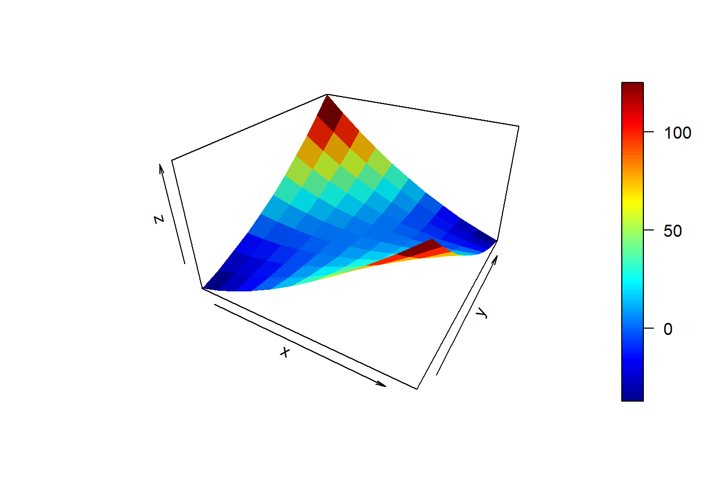
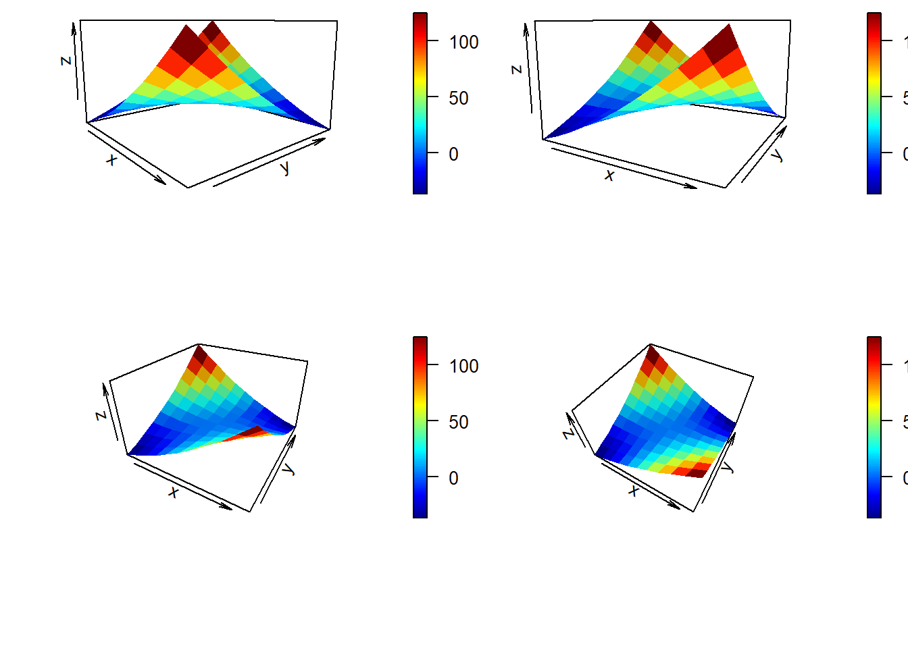

# Unconstrainted optimization
In calculus, optimization is the process of finding the maximum or minimum value of a function. This is often done using the techniques of calculus, such as taking derivatives or using the first or second derivative test.

The derivative of a function is a measure of its rate of change and can be used to identify the local maxima and minima of the function. For example, if the derivative of a function is positive at a certain point, this indicates that the function is increasing at that point and may have a local minimum nearby. Similarly, if the derivative is negative at a certain point, this indicates that the function is decreasing at that point and may have a local maximum nearby.

By using derivatives to identify local maxima and minima, we can find the values of the function that give the maximum or minimum output. This is useful in many applications, such as finding the maximum profit in a business, the minimum amount of time to complete a task, or the maximum likelihood of a statistical model.

In summary, optimization using derivatives is the process of using calculus to find the maximum or minimum value of a function. By taking derivatives and using the first or second derivative test, we can identify the points at which the function has a local maximum or minimum and find the values that give the maximum or minimum output.

The examples we explore in this lecture are called unconstrained optimization. Unconstrained optimization is a type of optimization problem with no constraints on the solution. In other words, the solution can take any value that maximizes or minimizes the objective function without constraints.

Unconstrained optimization problems are typically simpler than constrained optimization problems since there are no constraints to consider when finding the optimal solution.

## Example with bivariate quadratic function
The quadratic function is a polynomial function of form f(x) = ax^2 + bx + c, where a, b, and c are constants. A quadratic function can have a maximum or minimum value depending on the values of a, b, and c.

Here is an example of using derivatives to optimize a quadratic function. It's called the analytical approach. For example, suppose we have the following quadratic function:

$$ y = f(x) = x^2 - 4x + 3 $$

To find the maximum or minimum value of this function, we can take the derivative and set it equal to 0:

$$ f'(x) = \frac{\partial y}{\partial x} = 2x - 4 = 0 $$

Solving this equation, we find that the derivative is 0 at $x = 2$. This indicates that the function has a local maximum or minimum at $x = 2$.

To determine whether the function has a maximum or minimum at this point, we can take the second derivative of the function and evaluate it at $x = 2$:

$$ f''(x) = \frac{\partial^2 y}{\partial x^2} = 2 $$

Evaluating this at $x = 2$, we get $f''(2) = 2$. Since the second derivative is positive at this point, this indicates that the function has a local minimum at $x = 2$.

Therefore, to find the minimum value of the quadratic function, we can substitute $x = 2$ into the original function to get:

$$ f(2) = 2^2 - 4 \cdot 2 + 3 = -1 $$

Thus, the minimum value of the function is 1, which is achieved at $x = 2$.

In this example, we used derivatives to find the minimum value of a quadratic function. By taking the first and second derivatives of the function and setting them equal to 0, we were able to identify the points at which the function had a local minimum and find the values that give the minimum output.

### Example with R codes
Let's first define the function in R.

```r
# Define the function
f <- function(x) {
  y <- x^2 - 4*x + 3
  return(y)
}
```

Here we have function, where given the value of $x$, you can generate the value of $y$. For example when when the value of x = 40 the $y=f(x)=f(40)=40^2 - 4*40 + 3$ equates to 1443.


```r
value_of_y <- f(x = 40)
```

Let's plot this function, for the sequences of x value ranging from -5 to +5 by 0.1.

```r
# Create a sequence of x values from -10 to 10
x <- seq(-5, 5, by = 0.1)
x
#>   [1] -5.0 -4.9 -4.8 -4.7 -4.6 -4.5 -4.4 -4.3 -4.2 -4.1 -4.0
#>  [12] -3.9 -3.8 -3.7 -3.6 -3.5 -3.4 -3.3 -3.2 -3.1 -3.0 -2.9
#>  [23] -2.8 -2.7 -2.6 -2.5 -2.4 -2.3 -2.2 -2.1 -2.0 -1.9 -1.8
#>  [34] -1.7 -1.6 -1.5 -1.4 -1.3 -1.2 -1.1 -1.0 -0.9 -0.8 -0.7
#>  [45] -0.6 -0.5 -0.4 -0.3 -0.2 -0.1  0.0  0.1  0.2  0.3  0.4
#>  [56]  0.5  0.6  0.7  0.8  0.9  1.0  1.1  1.2  1.3  1.4  1.5
#>  [67]  1.6  1.7  1.8  1.9  2.0  2.1  2.2  2.3  2.4  2.5  2.6
#>  [78]  2.7  2.8  2.9  3.0  3.1  3.2  3.3  3.4  3.5  3.6  3.7
#>  [89]  3.8  3.9  4.0  4.1  4.2  4.3  4.4  4.5  4.6  4.7  4.8
#> [100]  4.9  5.0
```

Now Lets evaluate the function and plot.

```r
# Evaluate the function at each x value
y <- f(x)

y
#>   [1] 48.00 46.61 45.24 43.89 42.56 41.25 39.96 38.69 37.44
#>  [10] 36.21 35.00 33.81 32.64 31.49 30.36 29.25 28.16 27.09
#>  [19] 26.04 25.01 24.00 23.01 22.04 21.09 20.16 19.25 18.36
#>  [28] 17.49 16.64 15.81 15.00 14.21 13.44 12.69 11.96 11.25
#>  [37] 10.56  9.89  9.24  8.61  8.00  7.41  6.84  6.29  5.76
#>  [46]  5.25  4.76  4.29  3.84  3.41  3.00  2.61  2.24  1.89
#>  [55]  1.56  1.25  0.96  0.69  0.44  0.21  0.00 -0.19 -0.36
#>  [64] -0.51 -0.64 -0.75 -0.84 -0.91 -0.96 -0.99 -1.00 -0.99
#>  [73] -0.96 -0.91 -0.84 -0.75 -0.64 -0.51 -0.36 -0.19  0.00
#>  [82]  0.21  0.44  0.69  0.96  1.25  1.56  1.89  2.24  2.61
#>  [91]  3.00  3.41  3.84  4.29  4.76  5.25  5.76  6.29  6.84
#> [100]  7.41  8.00
```

This code creates a sequence of x values from -10 to 10, with a step size of 0.01. It then evaluates the function at each x value and plots the resulting y values. The resulting plot should look like this


```r
# Plot the function
plot(x, y, type = "l", col = "blue", xlab = "x", ylab = "f(x)")

# Add a point at the minimum of the function
points(2, -1, col = "red", pch = 16)
```



The plot shows that the function has a minimum at around x = 2, as we found using derivatives earlier. You can also see that the function is symmetric around x = 1, which is the x-coordinate of the vertex of the parabola (the point at which the parabola changes direction).

## Example with multivariate quadratic function
A multivariate optimization problem involves finding the optimal values for multiple variables (in this case, x and z) to minimize or maximize a given objective function (in this case, f(x, z)). In other words, the goal is to find the values of x and z that will produce the best result when plugged into the objective function.

Here is an example of using derivatives to optimize a multivariate function. Suppose we have the following function:

$$ f(x, z) = x^2 + z^2 - 4xz + 3 $$

To find the maximum or minimum value of this function, we can take the partial derivatives with respect to each variable and set them equal to 0:

$$ \frac{\partial f}{\partial x} = 2x - 4z = 0 $$

$$ \frac{\partial f}{\partial z} = 2z - 4x = 0 $$

Solving these equations, we find that the partial derivatives are 0 at $x = z = 2$. This indicates that the function has a local maximum or minimum at these coordinates.

To determine whether the function has a maximum or minimum at this point, we can take the second partial derivatives of the function and evaluate them at $x = z = 2$:
$$ \frac{\partial^2 f}{\partial x^2} = 2 $$

$$ \frac{\partial^2 f}{\partial z^2} = 2 $$

$$ \frac{\partial^2 f}{\partial x \partial z} = -4 $$

Evaluating these at $x = z = 2$, we get:

$$ \frac{\partial^2 f}{\partial x^2} = 2 $$

$$ \frac{\partial^2 f}{\partial z^2} = 2 $$

$$ \frac{\partial^2 f}{\partial x \partial z} = -4 $$

We can then use these values to compute the Hessian matrix of the function at this point, which is given by:

$$ H = \begin{bmatrix} \frac{\partial^2 f}{\partial x^2} & \frac{\partial^2 f}{\partial x \partial z} \\ \frac{\partial^2 f}{\partial z \partial x} & \frac{\partial^2 f}{\partial z^2} \end{bmatrix} = \begin{bmatrix} 2 & -4 \\ -4 & 2 \end{bmatrix} $$

The Hessian matrix is a square matrix that is used in multivariate optimization to approximate the behavior of a function near a given point. In particular, the Hessian matrix is used to determine the local curvature of a function, which can help to identify the location of a local minimum or maximum. or example, if the Hessian matrix is positive definite at a given point, this indicates that the function is locally convex at that point, which means that it has a local minimum in the vicinity. On the other hand, if the Hessian matrix is negative definite at a given point, this indicates that the function is locally concave, which means that it has a local maximum in the vicinity.

The Hessian matrix is a matrix of second-order partial derivatives that can be used to determine the nature of the local maximum or minimum at a given point. In this case, the Hessian matrix is negative definite as the determinant of $H$ is $2(2)-(-4)(-4) = 4-16=-12$.

### Example with R codes
This code defines a function f() that takes two inputs, x and z, and returns the value of $x^2 + z^2 - 4*x*z + 3$.


```r
f <- function(x, z){
  return(x^2 + z^2 - 4*x*z + 3)
}
```

The xaxis and yaxis vectors are created by using the : operator to generate a sequence of numbers from -5 to 5. This creates two vectors of length 11 with values ranging from -5 to 5, inclusive.


```r
xaxis <- -5:5
yaxis <- -5:5
```

The zaxis vector is then computed by applying the f() function to each combination of x and z values in xaxis and yaxis, respectively. This is done using the outer() function, which applies a function to all combinations of elements from two or more input vectors. In this case, outer() is used to apply the f() function to each combination of x and z values in xaxis and yaxis, respectively.

The result is a two-dimensional array (matrix) of values, with the ith row and jth column containing the value of f(x = xaxis[i], z = yaxis[j]). This array is assigned to zaxis.


```r
zaxis <- outer(xaxis, yaxis, f)
zaxis
#>       [,1] [,2] [,3] [,4] [,5] [,6] [,7] [,8] [,9] [,10]
#>  [1,]  -47  -36  -23   -8    9   28   49   72   97   124
#>  [2,]  -36  -29  -20   -9    4   19   36   55   76    99
#>  [3,]  -23  -20  -15   -8    1   12   25   40   57    76
#>  [4,]   -8   -9   -8   -5    0    7   16   27   40    55
#>  [5,]    9    4    1    0    1    4    9   16   25    36
#>  [6,]   28   19   12    7    4    3    4    7   12    19
#>  [7,]   49   36   25   16    9    4    1    0    1     4
#>  [8,]   72   55   40   27   16    7    0   -5   -8    -9
#>  [9,]   97   76   57   40   25   12    1   -8  -15   -20
#> [10,]  124   99   76   55   36   19    4   -9  -20   -29
#> [11,]  153  124   97   72   49   28    9   -8  -23   -36
#>       [,11]
#>  [1,]   153
#>  [2,]   124
#>  [3,]    97
#>  [4,]    72
#>  [5,]    49
#>  [6,]    28
#>  [7,]     9
#>  [8,]    -8
#>  [9,]   -23
#> [10,]   -36
#> [11,]   -47
```

Think of zaxis comprises. First the values as value of z-axis (y-variable) for xaxis being -5 to 5, holding value of yaxis constant, like partial derivative of $\frac{\partial y}{\partial x}|_{z}$. Second, the values as value of z-axis for yaxis being -5 to 5, holding value of xaxis constant, like partial derivative of $\frac{\partial y}{\partial z}|_{x}$.


```r

library(plot3D)
#> Warning: package 'plot3D' was built under R version 4.0.5
persp3D(
  z = zaxis,
  x = xaxis,
  y = yaxis,
  phi = 30,
  theta = 30,
  box = TRUE,
  border = NA,
  shade = .1,
  expand = 0.6,
  contour = F,
  axes = TRUE
)
```



Next, the plot3D library is loaded, and a 3D perspective plot is created using the values in zaxis, xaxis, and yaxis as the z, x, and y coordinates, respectively. The plot is rotated by 30 degrees along the x and y axes, and a box is drawn around the plot with slight shading. The contour lines are not drawn, and axes are displayed.

In this plot, you can visually see the minimum value of function $y = x^2 + z^2 - 4*x*z + 3$. When $x=2$ and $z=2$, the function will have the minimum value at $y = 2^2 + 2^2 - 4*2*2 + 3 = -5$.

Let's examine the above plot from different camera angles.

```r
par(mfrow = c(2, 2), mai = c(1, 0.1, 0.1, 0.1))
persp3D(z = zaxis, x = xaxis, y = yaxis, 
        phi = 10, 
        theta = 50, 
        box = TRUE, border = NA, shade = .1, expand = 0.6, contour = F)

persp3D(z = zaxis, x = xaxis, y = yaxis, 
        phi = 10, 
        theta = 30, 
        box = TRUE, border = NA, shade = .1, expand = 0.6, contour = F)

persp3D(z = zaxis, x = xaxis, y = yaxis, 
        phi = 30, 
        theta = 30, 
        box = TRUE, border = NA, shade = .1, expand = 0.6, contour = F)

persp3D(z = zaxis, x = xaxis, y = yaxis, 
        phi = 50, 
        theta = 30, 
        box = TRUE, border = NA, shade = .1, expand = 0.6, contour = F)
```



```r
par(mfrow = c(1, 1))
```


## Exercise
> Show the analytic solution for the minima of $f(x) = -18x^2 +180x + 10$ and show a graphical illustration using R codes.

> Find the optimal solution to $y = -4x^2 + -6z^2 - 3*x*z + 3$ and show a graphical illustration using R codes.
