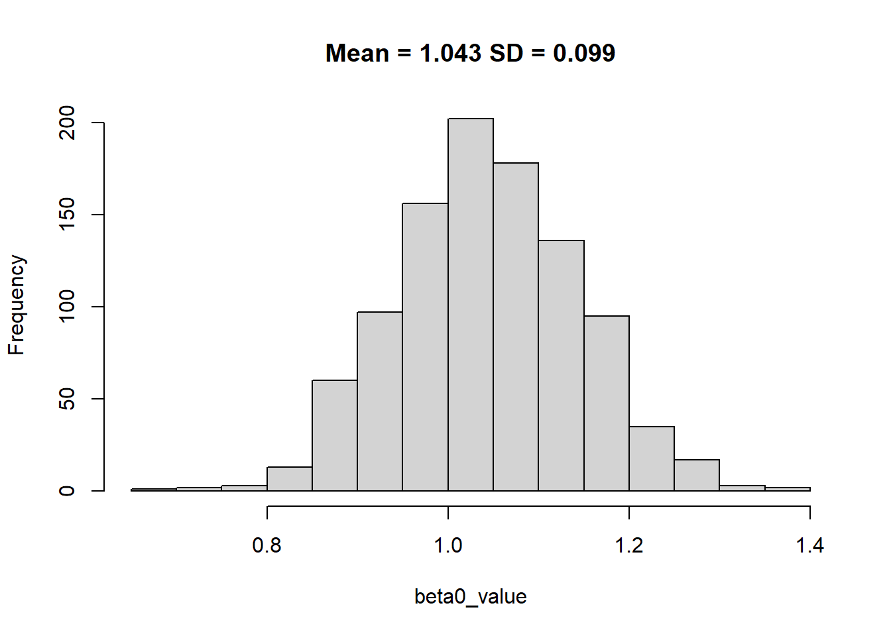
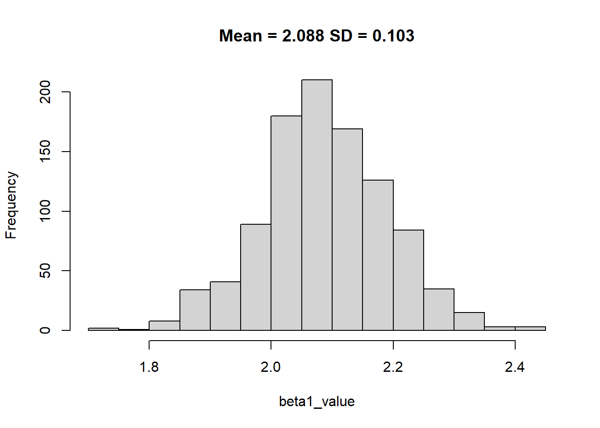
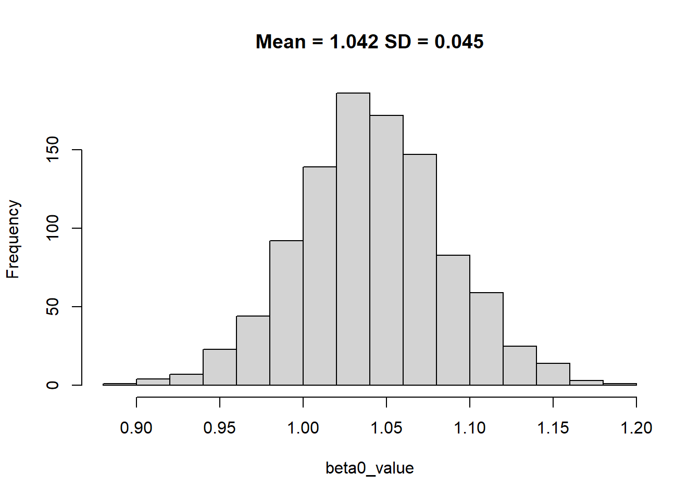
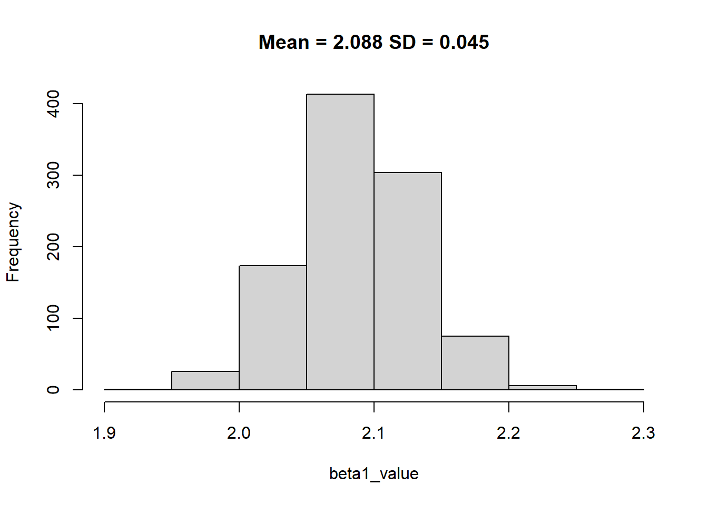

# Standard error

## Standard error of linear regression

The standard error of linear regression is a measure of how well the regression line fits the data. It represents the average distance that the data points fall from the regression line. The smaller the standard error, the better the regression line fits the data.

Intuitively, you can think of the standard error as the "average" distance that each data point is from the regression line. For example, if the standard error is 0.5, then on average, each data point is 0.5 units away from the regression line.

The standard error is used to construct confidence intervals for the predicted values of the dependent variable. For example, if the standard error is 0.5 and the confidence level is 95%, then we can be 95% confident that the true value of the dependent variable will fall within 1 standard error (0.5) of the predicted value.

In general, a smaller standard error indicates that the data points are closer to the regression line, which means that the regression model is a better fit for the data. However, it is important to remember that the standard error is only one measure of goodness-of-fit, and other factors should also be considered when evaluating a regression model.


Here is the step-by-step process:

1. To calculate the standard error of the estimate in simple linear regression, first find the difference between the observed value of the dependent variable (y) and the predicted value of the dependent variable (ŷ) for each data point. These differences are called residuals.

2. Next, square each of the residuals and add them up. This will give you the sum of squares of the residuals, which is also known as the error sum of squares (ESS).

3. Then, divide the ESS by the degrees of freedom for the model, which is the number of data points minus the number of regression coefficients. This will give you the mean square error (MSE).

4. Finally, take the square root of the MSE to find the standard error of the estimate. This is the measure of how well the regression line fits the data.


```r
set.seed(123)
# Lets define the number of observation
n <- 1000

# generate some random data
x = rnorm(n)
y = 1 + 2 * x + rnorm(n)

# fit a linear regression model
model = lm(y ~ x)

# calculate the residuals
residuals = residuals(model)

# calculate the error sum of squares
ess = sum(residuals^2)

# calculate the degrees of freedom for the model
df = length(x) - length(coef(model))

# calculate the mean square error
mse = ess / df

# calculate the standard error of the estimate
se = sqrt(mse)

# print the result
se
#> [1] 1.006395
```

Or alternatively, you can run the linear model and check for yourself as:


```r
# calculate the standard error of the regression
summary(lm(y~x))$sigma
#> [1] 1.006395
```

You can also check the summary of the regression, can you find where the R puts the standard error of the linear model?

```r
summary(lm(y~x))
#> 
#> Call:
#> lm(formula = y ~ x)
#> 
#> Residuals:
#>     Min      1Q  Median      3Q     Max 
#> -3.0279 -0.6914  0.0043  0.7087  3.2911 
#> 
#> Coefficients:
#>             Estimate Std. Error t value Pr(>|t|)    
#> (Intercept)  1.04105    0.03183   32.71   <2e-16 ***
#> x            2.08805    0.03211   65.03   <2e-16 ***
#> ---
#> Signif. codes:  
#> 0 '***' 0.001 '**' 0.01 '*' 0.05 '.' 0.1 ' ' 1
#> 
#> Residual standard error: 1.006 on 998 degrees of freedom
#> Multiple R-squared:  0.8091,	Adjusted R-squared:  0.8089 
#> F-statistic:  4229 on 1 and 998 DF,  p-value: < 2.2e-16
```

## Standard error of a regression coefficient

The standard error of a regression coefficient is the standard deviation of the sampling distribution of the coefficient. In other words, it is a measure of how accurately the regression coefficient estimates the population parameter.

The standard error of a regression coefficient is used to construct confidence intervals for the true value of the coefficient. For example, if the standard error of a regression coefficient is 0.1 and the confidence level is 95%, then we can be 95% confident that the true value of the coefficient lies within 0.2 of the estimated value (0.1 * 2 = 0.2).

To calculate the standard error of a regression coefficient, you need to know the standard error of the regression, which is the estimated standard deviation of the error term. The standard error of the regression coefficient is then calculated as the standard error of the regression divided by the square root of the sum of squares of the independent variable.


```r
# calculate the standard error of the regression
se = summary(model)$sigma

# calculate the sum of squares of the independent variable
ssx = sum(x^2)

# calculate the standard error of the regression coefficient
se_beta = se / sqrt(ssx)

# print the result
se_beta
#> [1] 0.03210335
```


```r
# calculate the standard error of the regression
se = summary(model)$sigma

# calculate the sum of squares of the independent variable
ssx = sum(x^2)

# calculate the means of the independent variable
x_mean = mean(x)

# calculate the standard error of the intercept
se_beta0 = se * sqrt(1/n + x_mean^2/ssx)

# print the result
se_beta0
#> [1] 0.03182923
```

## Simulation


```r
# generate some random data
df <- data.frame(x = x, y = y)
beta0_value <- c()
beta1_value <- c()
for(i in 1:1000){
  # sample 200 rows from the data frame with replacement
  sample_data <- df[sample(nrow(df), size = 100, replace = TRUE), ]
  
  # fit a linear regression model
  sample_model <- lm(y ~ x, data = sample_data)
  
  # Extract the intercept from sample model
  beta0_value[i] <- sample_model$coefficients[1]
  
  # Extract the slope coefficient from sample model
  beta1_value[i] <- sample_model$coefficients[2]
}
```


```r

hist(beta0_value, main = paste0("Mean = ", round(mean(beta0_value),3), " SD = ", round(sd(beta0_value),3)))
```



```r

hist(beta1_value, main = paste0("Mean = ", round(mean(beta1_value),3), " SD = ", round(sd(beta1_value),3)))
```



If we could increase the size from 100 to more, the standard deviation of beta coeffecient would reduce.


```r
beta0_value <- c()
beta1_value <- c()
for(i in 1:1000){
  # sample 200 rows from the data frame with replacement
  sample_data <- df[sample(nrow(df), size = 500, replace = TRUE), ]
  
  # fit a linear regression model
  sample_model <- lm(y ~ x, data = sample_data)
  
  # Extract the intercept from sample model
  beta0_value[i] <- sample_model$coefficients[1]
  
  # Extract the slope coefficient from sample model
  beta1_value[i] <- sample_model$coefficients[2]
}

hist(beta0_value, main = paste0("Mean = ", round(mean(beta0_value),3), " SD = ", round(sd(beta0_value),3)))
```



```r

hist(beta1_value, main = paste0("Mean = ", round(mean(beta1_value),3), " SD = ", round(sd(beta1_value),3)))
```




The key learning here is that with random sampling of the data we were able to identify the coefficient however with more data we improve the precision by reducing the standard error.
